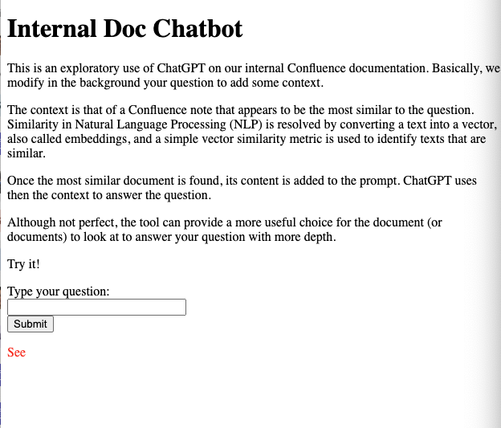

# Run chatGPT with internal confluence pages.

NOTES: Not fully functional

Ref: https://medium.com/@francois.ascani/running-chatgpt-on-your-internal-confluence-documentation-d7761aa8fc68 

### Usages

* get the OpenAI API Key

ref: https://platform.openai.com/account/api-keys

* get atlassian access key

[create first a personal API token (PAT)](https://confluence.atlassian.com/enterprise/using-personal-access-tokens-1026032365.html)

Account profile -> Settings -> Password -> Create and manage API tokens

* update environment variable

```
$ cp .env.sample .env

# update all keys in .env
```

run a test to get confluence pages
```
$ virtualenv env
$ source env/bin/activate

$ pip install -r requirements.txt
python ./get_pages.py
```
If successful, you will see two files

```
$ ls output_*
output_100.json  output_all.json
```

Run the application
```
$ virtualenv env
$ source env/bin/activate
$ flask run
...
 * Running on http://127.0.0.1:5000
Press CTRL+C to quit
```

Wait for a while (60+ seconds), you can access the website locally

Access the application via http://127.0.0.1:5000


